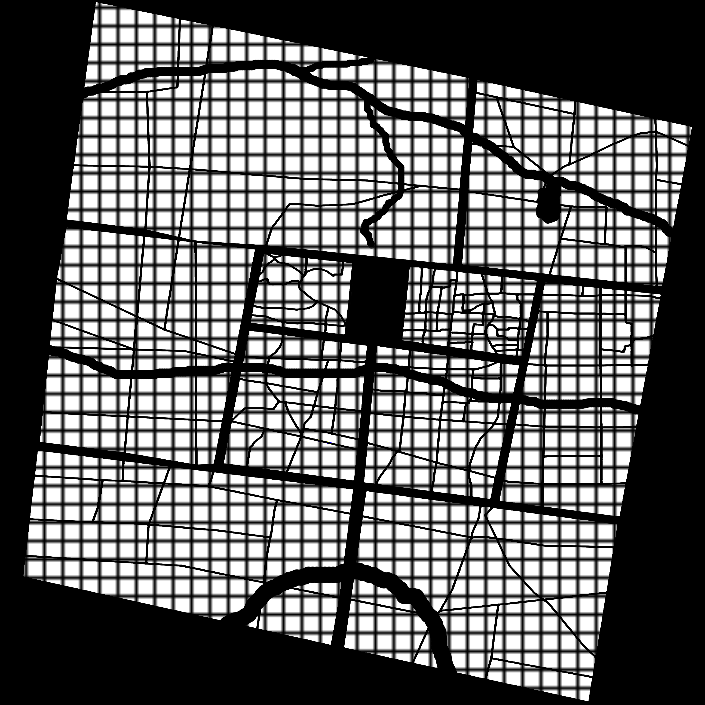

# BitMap2XML_Matlab
This project can read a picture and get the position of each connected domain, and write them in XML format. There is another project I wrote in unity to read this XML file. https://github.com/ElementMo/XMLRead

